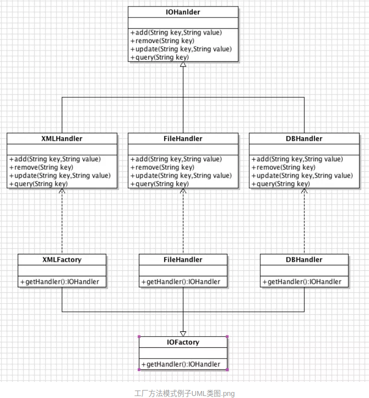
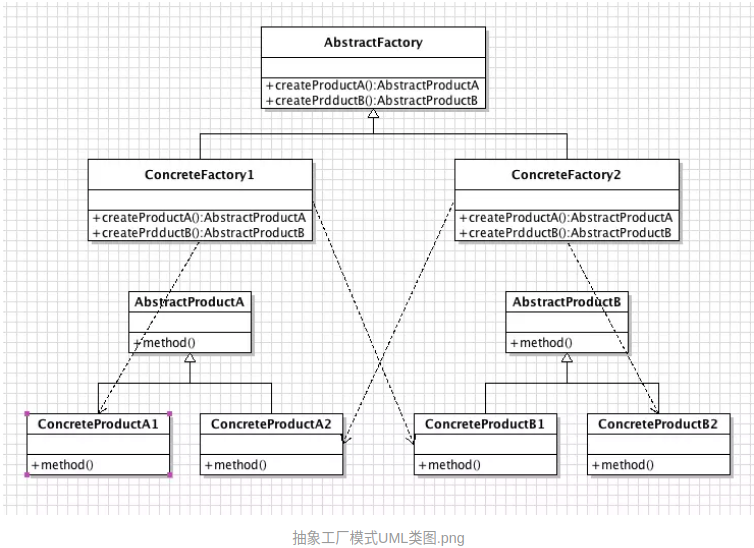

# 行为型模式
## Strategy mode

### example one
#### reference
https://blog.csdn.net/weixin_40841731/article/details/82995908

#### 总结：
策略模式其实就是，利用一个中间类--策略类(ParamValidateStrategy)。来连接策略对象(./src/com/zr/check/*)与业务类(ParamValidateUtil)。策略类不知道业务类用什么策略对象，
策略类也不知道具体调什么策略对象，策略类只是拥有父接口对应及调用父接口的方法。这就起到了解耦的作用。 当业务类指定具体策略对象，传给策略类，策略类就知道想要调用的策略对象了。

##### 关键  
1.利用反射从枚举中获取某一具体的策略类。
```text

//反射获取枚举类
 Class<Enum> clazz = (Class<Enum>)Class.forName("com.zr.util.Constant$ParamValidate");
 //获取所有枚举实例
 Enum[] enumConstants = clazz.getEnumConstants();
 //根据方法名获取方法
 //根据方法名获取方法
 Method getDesc = clazz.getMethod("getDesc");
 Method getIndex = clazz.getMethod("getIndex");
 String validateType = null;
 for (Enum enum1 : enumConstants) {
     //判断枚举值与数据库中存的检查类型是否一致，一致就校验，不一直跳过
     if(((Integer)getIndex.invoke(enum1))==
             Integer.parseInt(sqlParam.getValidateType())){
        //执行枚举方法获得枚举实例对应的值
         validateType  = (String)getDesc.invoke(enum1);
         break;
     }else{
         continue;
     }
 }
 if(validateType==null){
     errorMsgList.add("校验类型不存在！");
     return errorMsgList;
 }

 //根据数据库中储存的枚举类型，根据枚举值获取对应的枚举描述，从而反射生成校验类（校验类的类名与枚举描述必须一致）
 Class<?> forName = Class.forName("com.zr.check."+validateType);
 Object obj = forName.newInstance();
 ParamValidateStrategy	paramValidateStrategy = new ParamValidateStrategy((ParamValidate) obj);
 String message = paramValidateStrategy.validate(paramValue,sqlParam.getValidateVal());
```

2.具体的策略类抽取了接口，且业务类持有接口引用


### example two
#### reference
https://blog.csdn.net/maxchenbug/article/details/101738795
使用常用，支付，之前做了微信支付，支付宝支付，然后另外一个同事写了一个银联支付，那么如果代码方法一起就会导致代码不是很好操作所以，采用策略模式进行，同事只需要写一个实现类，就可以了，
在协作过程中比较容易。    

优点： 1、算法可以自由切换。 2、避免使用多重条件判断。 3、扩展性良好。
缺点： 1、策略类会增多。 2、所有策略类都需要对外暴露。

注：如果一个系统的策略多于四个，就需要考虑使用混合模式，解决策略类膨胀的问题。

test requests from client
curl -H "Content-Type:application/json" -X POST -d '{"name": "A", "poolId":"axxStrategy", "orderId": "O_001"}' http://localhost:8080/choose
curl -H "Content-Type:application/json" -X POST -d '{"name": "B", "poolId":"bxxStrategy", "orderId": "O_002"}' http://localhost:8080/choose


# 创建型模式
## factory mode
### simple-factory mode
#### example one

https://blog.csdn.net/weixin_41725090/article/details/81066252

### factory-method mode
#### example one
https://www.jianshu.com/p/f3c1057b989b


总结: 
    我们已经完成了工厂方法模式的使用了，如果新增存储方式的话就新增工厂类和新增具体产品类。生成复杂对象时，无需知道具体类名，只需知道相应的工厂方法即可。
但其实过多的类必然会导致结构复杂化，这也是难以避免的。所以某些简单的情况下可以权衡是否使用工厂模式了。

工厂方法模式VS简单工厂模式
在简单工厂模式中，确定只有一个工厂的情况去实现业务逻辑，被视为是工厂方法模式的一种弱化版本。

简单工厂模式的最大优点在于 **工厂类中包含 必要的逻辑判断**，**根据客户端的选择条件动态实例化**相关的类。简单工厂模式只需要知道工厂类中代表具体产品的参数即可。
工厂方法模式实现时， 客户端需要决定 实例化哪一个工厂来实现相关的类，选择判断的问题还是存在的，工厂方法把简单工厂的 **内部判断逻辑转移到了客户端** 中进行。工厂方法模式只需要知道具体工厂类即可。


### abstract-factory mode

actory（抽象工厂类）：工厂模式方法核心，创建一系列产品对象。
ConcreteFactory（具体工厂类）：实现抽象工厂中定义的创建产品的方。

用法：
一个对象组有相同的约束时可以使用抽象工厂模式

个人理解：
在生产多个产品组合的对象时使用抽象工厂模式，也就是需要在一个工厂中生成一系列特定的产品对象时使用这模式，本质还是创建对象。


更换数据库例子
需求：用抽象工厂模式实现数据库表操作


简单工厂模式 VS 工厂方法模式 VS 抽象工厂模式
三种工厂方法，第一次学习的时候可能会混乱，下面来总结一下：
简单工厂--用于创建对象的接口，让子类决定实例化那个类；生成一个复杂对象；IProduct p = EasyFactory.create("a");  
工厂方法--用于创建对象的接口，让子类决定实例化那个类；生成一个复杂对象；IProduct p = new Facotry().getProduct();  
抽象工厂--为创建一组相关或者是相互依赖的对象提供一个接口；生成一组复杂对象；IFactory f = new Factory(); ProductA a = f.getProductA(); PrdocutB b = f.getProductB();  


抽象工厂模式其实就是创建一系列对象时用的，更具有“品牌效应”。

相同点
用法一样，本质是创建复杂对象
产品角色结构一样，每个具体产品角色都有相似的行为

2.2、不同点
选择逻辑：简单工厂模式感知不了工厂的存在，选择判断的逻辑在工厂类内部实现。工厂方法模式和抽象工厂模式的选择逻辑在客户端使用类，需要知道工厂的存在

创建对象：简单工厂模式和工厂方法模式用于创建一个复杂对象，抽象工厂模式用于创建一系列对象。

扩展产品：
简单工厂模式需要在工厂类内部增加新分支，改变了工厂类的内部结构；
工厂方法模式需要增加相应的工厂类，系统类的个数将成对增加；
抽象工厂模式需要修改抽象工厂和所有的具体工厂。

## 建造者模式


## 单例模式
单例模式是一种创建型模式。它保证一个类仅有一个实例，并提供一个访问它的全局访问点。
Singleton（单例类）：定义一个getInstance操作，允许客户访问它的唯一实例，getInstance是一个静态方法，主要负责**创建自己的唯一实例**。
最常用的一个设计模式。

个人理解：
•　创建一个对象需要消耗过多资源时（IO操作、访问数据库等）
•　工具类、帮助类（ 应用程序的日志应用、接入第三方SDK等）
•　频繁实例化然后销毁的对象（日志、网络访问等）

常见的写法有几种：饿汉式、懒汉式、懒汉式同步锁、双重校验锁、静态内部类的单例模式。

1.饿汉式（线程安全、没有懒加载）
见HungrySingleton

2.懒汉式
双重校验锁（线程安全，有懒加载）
见LazyLoadSingleton


3.静态内部类的单例模式（线程安全，有懒加载）
见Singleton


单例模式需要注意内存泄漏的问题，由于单例的静态特性使得其生命周期和应用的生命周期一样长，当一个对象已经不需要再使用本该被回收时，
而另外一个正在使用的对象持有它的引用从而导致它不能被回收，产生了内存泄漏(导致本该被回收的对象不能被回收而停留在堆内存中)。
另一个问题是线程安全问题。

单例模式引起的内存泄漏，解决方法：
1.静态对象的生命周期与应用程序的生命周期一致
2.持有传入的context的弱引用
见 https://blog.51cto.com/whatever957/1834138

###内存泄漏
内存泄露根本原因：
长生命周期的对象持有短生命周期对象的引用就很可能发生内存泄露，尽管短生命周期对象已经不再需要，但是因为长生命周期对象持有它的引用而导致不能被回收。
https://www.ibm.com/developerworks/cn/java/l-JavaMemoryLeak/
https://www.cnblogs.com/woaiadu/p/7169220.html
常见情况：
https://www.jdon.com/50632
https://www.jb51.net/article/154599.htm

实例：
https://www.cnblogs.com/invinboy/p/10842406.html
https://blog.csdn.net/qq_27376871/article/details/78492908
https://blog.csdn.net/m0_38110132/article/details/81986334
https://www.jianshu.com/p/c8f4e0e8270e
https://blog.51cto.com/12142907/2343854


## 原型模式
略


# 结构型模式


**推荐阅读**

<p><strong>基础篇：</strong>  
https://www.jianshu.com/p/fcb642ff3be5      设计模式前篇之——UML类图必会知识点
https://www.jianshu.com/p/11a08bf34e77      设计模式前篇之——一起过一下面向对象的概念


<strong>创建型模式：</strong>    
https://www.jianshu.com/p/b3600a262c38      简易理解设计模式之：简单工厂模式——来试试接入支付功能  
https://www.jianshu.com/p/f3c1057b989b      简易理解设计模式之：工厂方法模式——数据存储例子  
https://www.jianshu.com/p/af2c1f96af05      简易理解设计模式之：抽象工厂模式——更换数据库例子  
https://www.jianshu.com/p/8481e9094ec5      简易理解设计模式之：建造者模式——学习使用“链式调用”  
https://www.jianshu.com/p/d89b6f77a60f      简易理解设计模式之：原型模式——深、浅拷贝的概念  
https://www.jianshu.com/p/40f848b2af07      简易理解设计模式之：单例模式——单例模式的几种常用写法  


<strong>结构型模式：</strong>    
https://www.jianshu.com/p/d5dc1450ab7b      简易理解设计模式之：适配器模式——Android列表视图控件设计方式  
https://www.jianshu.com/p/07109eeb319c      简易理解设计模式之：桥接模式——穿衣服经典案例2  
https://www.jianshu.com/p/b55ddd99dfda      简易理解设计模式之：组合模式——实现View中的树状结构  
https://www.jianshu.com/p/191e761b07a1      简易理解设计模式之：装饰模式——穿衣服经典案例  
https://www.jianshu.com/p/45dcde8a0715      简易理解设计模式之：外观模式——第三方SDK的帮助类  
https://www.jianshu.com/p/ff677d73126b      简易理解设计模式之：享元模式——五子棋游戏例子  
https://www.jianshu.com/p/e8dad2365d99      简易理解设计模式之：代理模式——iOS视图控件设计方式  


<strong>行为型模式：</strong>   
https://www.jianshu.com/p/62055a3d19d6      简易理解设计模式之：策略模式——优化一下支付功能  
https://www.jianshu.com/p/98cb3f90660a      简易理解设计模式之：模板方法模式——Android中的BaseActivity基类  
https://www.jianshu.com/p/62ba7377340c      简易理解设计模式之：观察者模式——监听与回调  
https://www.jianshu.com/p/e1a56be82200      简易理解设计模式之：状态模式——优化登录操作  
https://www.jianshu.com/p/b7733f12d6a3      简易理解设计模式之：备忘录模式——Word文档的工作原理  
https://www.jianshu.com/p/27cfcdfb776c      简易理解设计模式之：迭代器模式——遍历对象的好帮手  
https://www.jianshu.com/p/1a6767821e9d      简易理解设计模式之：命令模式——实现命令的参数化配置  
https://www.jianshu.com/p/9529c58aa80b      简易理解设计模式之：责任链模式——OA中请假流程示例  
https://www.jianshu.com/p/feac0f5fd817      简易理解设计模式之：中介者模式——多人聊天室例子  
https://www.jianshu.com/p/e93b1cb3e8ab      简易理解设计模式之：解释器模式——语言和文法  
https://www.jianshu.com/p/bf4bca9e82e9      简易理解设计模式之：访问者模式——员工考核例子  


