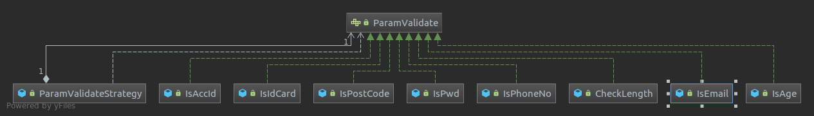

## Strategy mode

### example one
#### reference
https://blog.csdn.net/weixin_40841731/article/details/82995908

#### 总结：
策略模式其实就是，利用一个中间类--策略类(ParamValidateStrategy)。来连接策略对象(./src/com/zr/check/*)与业务类(ParamValidateUtil)。策略类不知道业务类用什么策略对象，
策略类也不知道具体调什么策略对象，策略类只是拥有父接口对应及调用父接口的方法。这就起到了解耦的作用。 当业务类指定具体策略对象，传给策略类，策略类就知道想要调用的策略对象了。

##### 关键  
1.利用反射从枚举中获取某一具体的策略类。
```text

//反射获取枚举类
 Class<Enum> clazz = (Class<Enum>)Class.forName("com.zr.util.Constant$ParamValidate");
 //获取所有枚举实例
 Enum[] enumConstants = clazz.getEnumConstants();
 //根据方法名获取方法
 //根据方法名获取方法
 Method getDesc = clazz.getMethod("getDesc");
 Method getIndex = clazz.getMethod("getIndex");
 String validateType = null;
 for (Enum enum1 : enumConstants) {
     //判断枚举值与数据库中存的检查类型是否一致，一致就校验，不一直跳过
     if(((Integer)getIndex.invoke(enum1))==
             Integer.parseInt(sqlParam.getValidateType())){
        //执行枚举方法获得枚举实例对应的值
         validateType  = (String)getDesc.invoke(enum1);
         break;
     }else{
         continue;
     }
 }
 if(validateType==null){
     errorMsgList.add("校验类型不存在！");
     return errorMsgList;
 }

 //根据数据库中储存的枚举类型，根据枚举值获取对应的枚举描述，从而反射生成校验类（校验类的类名与枚举描述必须一致）
 Class<?> forName = Class.forName("com.zr.check."+validateType);
 Object obj = forName.newInstance();
 ParamValidateStrategy	paramValidateStrategy = new ParamValidateStrategy((ParamValidate) obj);
 String message = paramValidateStrategy.validate(paramValue,sqlParam.getValidateVal());
```

2.具体的策略类抽取了接口，且业务类持有接口引用



### example two
#### reference
https://blog.csdn.net/maxchenbug/article/details/101738795
使用常用，支付，之前做了微信支付，支付宝支付，然后另外一个同事写了一个银联支付，那么如果代码方法一起就会导致代码不是很好操作所以，采用策略模式进行，同事只需要写一个实现类，就可以了，
在协作过程中比较容易。    

优点： 1、算法可以自由切换。 2、避免使用多重条件判断。 3、扩展性良好。
缺点： 1、策略类会增多。 2、所有策略类都需要对外暴露。

注：如果一个系统的策略多于四个，就需要考虑使用混合模式，解决策略类膨胀的问题。

test requests from client
curl -H "Content-Type:application/json" -X POST -d '{"name": "A", "poolId":"axxStrategy", "orderId": "O_001"}' http://localhost:8080/choose
curl -H "Content-Type:application/json" -X POST -d '{"name": "B", "poolId":"bxxStrategy", "orderId": "O_002"}' http://localhost:8080/choose


### curl 
get  
curl https://proxy.mimvp.com/login?user=admin&passwd=12345678

post
curl -d "key1=value1&key2=value2&key3=value3" protocol://ip:port/path
curl -H "Content-Type:application/json" -X POST -d '{"name": "B", "poolId":"bxxStrategy", "orderId": "O_002"}' http://localhost:8080/choose

如果想看到详细的请求信息，我们可以加上 -v 参数
curl localhost:9999/api/daizhige/article -v

更多见ubuntu/笔记/附录


### mockMvc
https://www.cnblogs.com/jiliunyongjin/p/7496104.html
http://b.edu.51cto.com/gddx/course/video?lessonId=264846

传递实体？？
StrategyControllerTest


